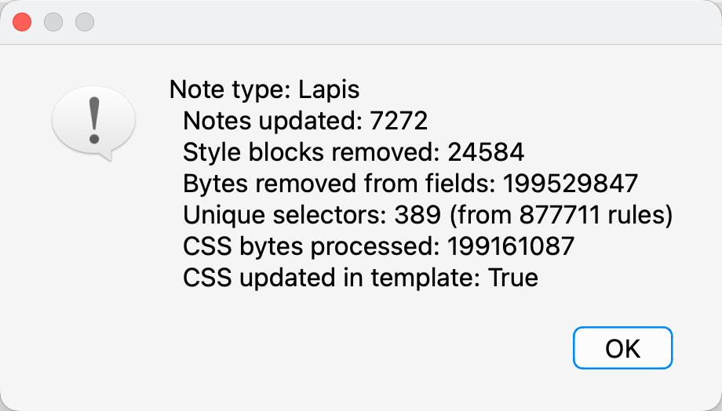

# Inline CSS Cleanup

Remove inline `<style>…</style>` blocks from selected note fields and move the CSS
into `collection.media/_extracted_css.css`, with selector-level deduplication.

This is useful when large HTML fields (e.g., Yomitan/JP mining glossaries)
embed repeated CSS, bloating `collection.anki2` and pushing you over AnkiWeb
size limits.

## What It Does

- Strips inline `<style>…</style>` blocks from configured fields
- Extracts CSS and **deduplicates by selector** (first occurrence wins)
- Writes the CSS to `collection.media/_extracted_css.css`
- Inserts a small `<style>@import ...</style>` into the field to load the CSS
- Optionally extracts repeated `style="..."` attributes into CSS classes

## Install

Option A — AnkiWeb code:

1. In Anki: **Tools → Add-ons → Get Add-ons…**
2. Enter the code `465508076`
3. Restart Anki

Option B — Build from source:

1. Download the source code
2. Run `./package.sh` to build `inline-css-cleanup.ankiaddon`
3. In Anki: **Tools → Add-ons → Install from file…**
4. Select the `.ankiaddon` file and restart Anki

## Release

GitHub Actions builds the add-on on pull requests, pushes to `main`, manual
runs, and tags matching `v*`.

To publish a release:

1. Create and push a tag such as `v0.1.0`
2. The workflow builds `dist/inline-css-cleanup.ankiaddon`
3. The tag run creates or updates the GitHub Release asset automatically

## Usage

1. **Tools → Inline CSS Cleanup**
2. Confirm the prompt
3. Review the summary dialog
4. Run **Check Database** to shrink the collection file after cleanup

## Example Screenshot



## Configuration

See `config.md` for detailed configuration.

Quick defaults (from `config.json`):

```json
{
  "note_types": ["Lapis"],
  "fields": ["Glossary", "MainDefinition"],
  "confirm_before_run": true,
  "extract_inline_styles": false,
  "inline_style_min_length": 80,
  "inline_style_min_ratio": 0.05
}
```

## Notes & Safety

- The add-on does not modify template Styling (useful if your Styling is auto-generated).
- Re-running is safe and idempotent: it will not duplicate imports or rules.
- Consider backing up your collection before the first run.
- Extracted inline styles are emitted with `!important` to better preserve appearance.
- Inline style extraction thresholds are based on the number of notes containing inline styles.
- Extracted CSS is stored in `collection.media/_extracted_css.css` and also mirrored to `user_files/extracted_css.css` (easier to find).

## License

AGPL-3.0-or-later
